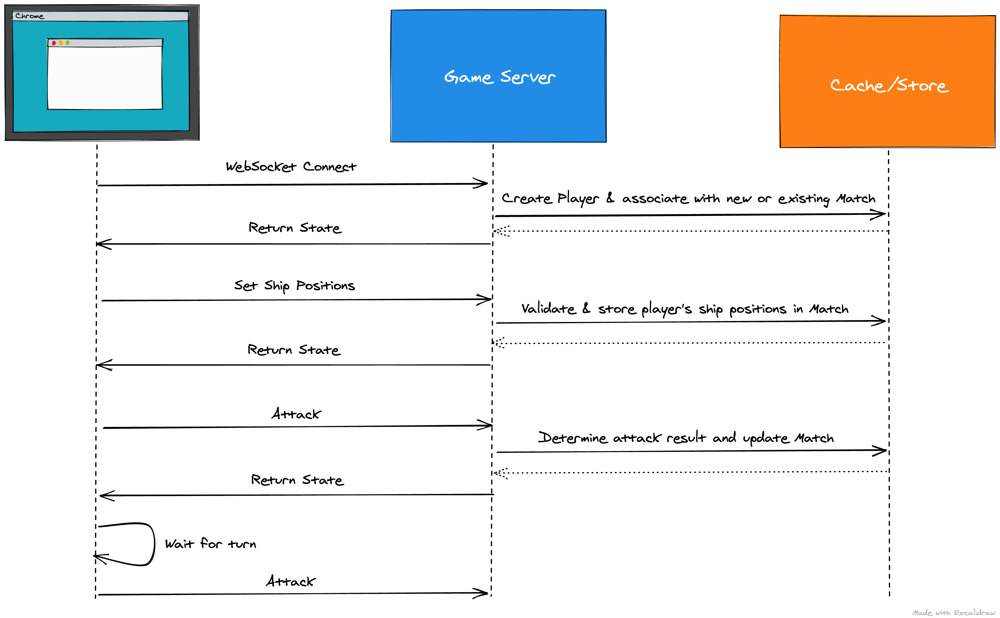

# Shipwars Game Server

WebSocket server for the Shipwars game.

## Requirements

- Node.js v14.3
- npm 6.14

## Building

The deployment to OpenShift uses a pre-built image. The image can be built and
pushed to an image registry using included scripts.

Requirements:

* [Source-to-Image (`s2i`)](https://github.com/openshift/source-to-image) (tested with v1.1.13)
* Docker (tested with v19.03.5)

Optional environment variables are supported to modify image registry and tag.

```bash
# These are the defaults defined in both scripts, so change them if you'd
# like to push a different tag or to another image registry/repository
export IMAGE_TAG=latest
export IMAGE_REPOSITORY=quay.io/evanshortiss/shipwars-game-server

./scripts/build.sh

./scripts/push.sh
```

## Deployment

Use the script documented [here](https://github.com/redhat-gamedev/shipwars-deployment#openshift).

## Local Development

Use the Docker Compose setup documented [here](https://github.com/redhat-gamedev/shipwars-deployment#docker-local-development-mode).

## About

A simplified version of the [backend](https://github.com/rhdemo/2021-frontend-wss)
used for the live keynote demo at Red Hat Summit 2021.

The initial deployment was performed using a [StatefulSet](https://kubernetes.io/docs/concepts/workloads/controllers/statefulset/).
Since the codebase in this repository is designed to run as a single Pod, certain
oddities from the previous StatefulSet architecture might be hanging about.

Game flow is summarised in the following sequence(ish) diagram. This activity
continues until a player has sunk all of the opposing player's ships.



### Endpoints

Two WebSocket endpoints are exposed:

* `$HOST:$PORT/game` - The [Shipwars Client](https://github.com/redhat-gamedev/shipwars-client) uses this to facilitate gameplay.
* `$HOST:$PORT/leaderboard` - The [Shipwars Dashboard](https://github.com/redhat-gamedev/2021-dashboard-ui) uses this to render the leaderboard in real-time.

### Cache/Storage

This iteration of the game uses a simple Node.js in-memory cache. Entries have
a TTL of 1 hour before they are flushed.

Previous versions used an external Infinispan cache.

### Models

The game stores state using the following models. All model instances have a
unique UUID. Models are written to the cache for storage.

* `Game` - Game is the top-level state that all matches inherit from. Previously could be [updated using an external cache](https://github.com/rhdemo/2021-frontend-wss/blob/master/src/stores/game/index.ts#L62) to pause, stop, reset the overall game and matches for each connected player.
* `Player` - Represents a connected player.
* `Match` - Represents a match that two players use to face-off.
* `MatchPlayer` - Represents match data specific to a player, e.g score, shots, ship positions. Two of these are stored in a `Match` instance.

### Kafka Integration

The following events are sent to Kafka, with the associated data to facilitate
reconstructing the events of a match/game, and generate statistics.

* Match Start (`match-start`) - One of these events is sent per match. Sent when both players lock their ship positions.
* Attack (`attack`) - Multiple attacks are sent per player, per match.
* Bonus (`bonus`) - Multiple bonuses are sent per player, per match. Unlucky players might not send many though!
* Match End (`match-start`) - One of these events is sent per match. Sent when a winner is determined.

### WebSocket Payloads

These are documented in the *src/payloads* folder, differentiated as *incoming* and *outgoing*.

Each client WebSocket has a mutex wrapper that locks while we process an
incoming payload. This is to prevent a malicious client sending multiple
attacks and other types of cheats.

Each incoming/outgoing message has the basic structure:

```js
{
  type: String
  data: Object
}
```

For example, an incoming attack frame from a client targeting cell `0,2` (x, y)
on the opponent grid:

```js
{
  type: 'attack',
  data: {
    origin: [0, 2]
  }
}
```

And a sample response frame stating that the attack landed a hit, and sank the
opponent's Destroyer. Some data is removed for brevity:

```js
{
  type: 'attack-result',
  data: {
    result: {
      hit: true,
      origin: [
        0,
        2
      ],
      type: "Destroyer",
      destroyed: true
    }
    // More data about the overall game state is also included,
    // but is not shown here since it's too verbose for an example
  }
}
```
